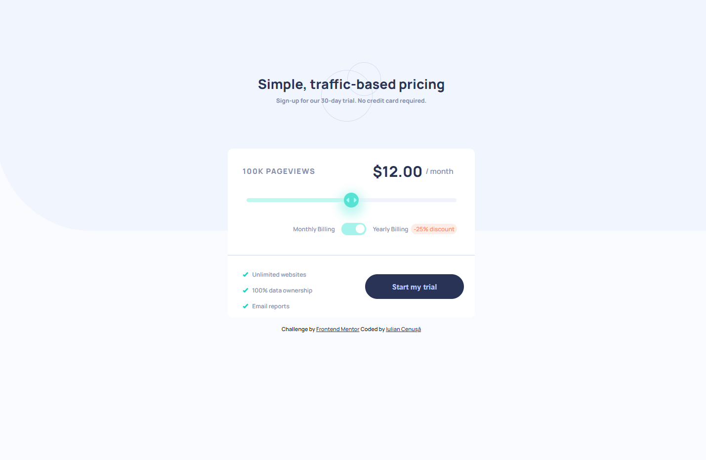
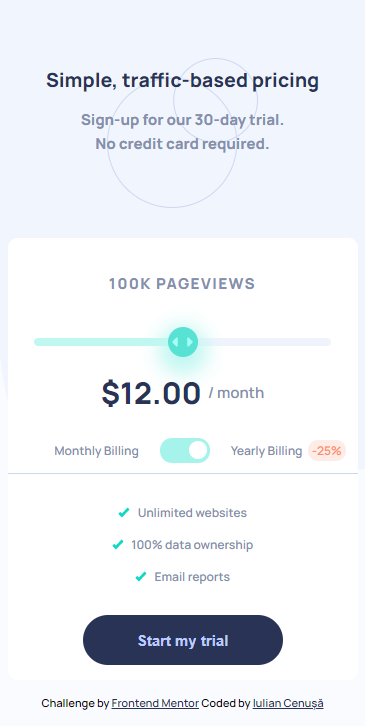

# Frontend Mentor - Interactive pricing component solution

This is a solution to the [Interactive pricing component challenge on Frontend Mentor](https://www.frontendmentor.io/challenges/interactive-pricing-component-t0m8PIyY8). Frontend Mentor challenges help you improve your coding skills by building realistic projects. 

## Table of contents

- [Overview](#overview)
  - [The challenge](#the-challenge)
  - [Screenshot](#screenshot)
  - [Links](#links)
- [My process](#my-process)
  - [Built with](#built-with)
  - [What I learned](#what-i-learned)
  - [Continued development](#continued-development)
  - [Useful resources](#useful-resources)
- [Author](#author)

## Overview

### The challenge

Users should be able to:

- View the optimal layout for the app depending on their device's screen size
- See hover states for all interactive elements on the page
- Use the slider and toggle to see prices for different page view numbers

### Screenshot

* On Desktop:

* On Mobile:

### Links

- Solution URL: [GitHub](https://github.com/iulian-cenusa/frontend-mentor-interactive-pricing-component)
- Live Site URL: [GitHub Pages](https://iulian-cenusa.github.io/frontend-mentor-interactive-pricing-component/)

## My process

### Built with

- Semantic HTML5 markup
- CSS custom properties
- Flexbox
- CSS Grid
- Mobile-first workflow

### What I learned

This project helped me understand how sliders and toggle buttons are built in HTML/CSS. Also it helped mw understand how absolute and relative positioning works in CSS.

### Continued development

This project can be improved to look more like the designs images.

### Useful resources

- [How to create range sliders](https://www.w3schools.com/howto/howto_js_rangeslider.asp) - This helped me with range sliders.
- [How to create toggle switch](https://www.w3schools.com/howto/howto_css_switch.asp) - This helped me with toggle switches.

## Author

- Frontend Mentor - [@iulian-cenusa](https://www.frontendmentor.io/profile/iulian-cenusa)
- Twitter - [@IulianCenusa](https://twitter.com/IulianCenusa)
- Other Projects - [Bitbucket Repo](https://bitbucket.org/iulian_cenusa/)
